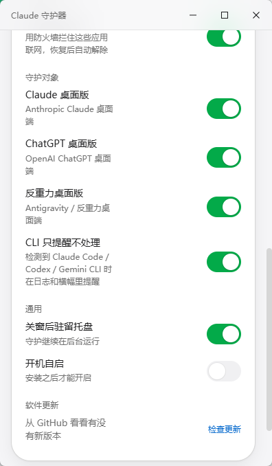
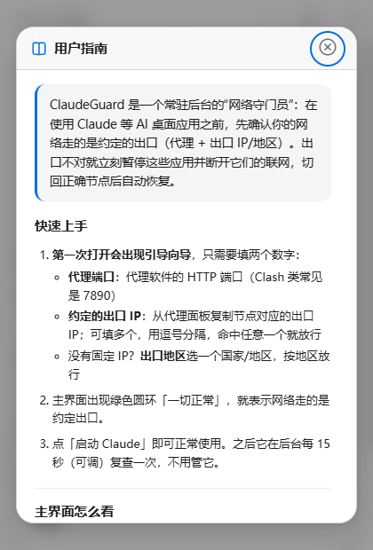

<p align="center">
  
</p>

<h1 align="center">ClaudeGuard (Claude 守护器)</h1>

<p align="center">
  <strong>给 AI 桌面应用加一道“网络出口门禁”</strong>
</p>

<p align="center">
  <a href="https://github.com/daha1216/ClaudeGuard/releases"></a>
  
  
  
</p>

---

### 一句话定位
ClaudeGuard 是专为 Windows 10/11 设计的 AI 应用网络出口门禁：只有当前代理出口 IP 处于约定名单内，才允许 AI 桌面应用启动和联网；出口一旦变动或异常，立即自动结束进程并使用 Windows 防火墙阻止其联网，切回合规节点后自动解除隔离。

### 为什么需要它
许多 AI 桌面应用对网络出口环境极其敏感。一旦本地代理节点漂移、断连直连或跳出预期国家地区，极易导致账号封禁或会话异常。ClaudeGuard 充当一道物理级的自动化安全卡口，杜绝应用在非预期网络环境下静默联网。

---

## 界面预览

<table>
  <tr>
    <td align="center" width="50%"><br><sub>主界面 · 校验通过，一键启动</sub></td>
    <td align="center" width="50%"><br><sub>设置 · 端口 / 多 IP 白名单 / 出口地区 / 守护开关</sub></td>
  </tr>
</table>

<p align="center">
  <br>
  <sub>内置用户指南 · 随开随查</sub>
</p>

---

## 功能亮点

- **启动闸门校验**：启动时执行三步串行校验（系统代理配置 → 代理握手 → 出口 IP），全部通过才放行目标应用启动。
- **常驻后台监测**：最小化至系统托盘静默运行，默认每 15 秒自动复检一次（检测间隔可自定义）。
- **异常瞬间熔断**：检测到出口异常时，自动结束守护范围内的 GUI 应用全部进程，并通过 Windows 防火墙添加出站/入站双向阻止规则；下一次检测通过自动恢复，亦支持托盘手动一键解除。
- **双重规则匹配**：支持“多 IP 白名单”与“出口地区（国家）”两种规则，可同时配置，任一命中即放行。
- **差异化多 Agent 守护**：GUI 桌面应用支持进程熔断与防火墙断网；CLI 工具仅记录提醒，防范误杀。
- **严密防误杀设计**：当探测服务双双失败（出口信息无法获取）时不盲目熔断；但若白名单与地区均留空，则永久禁止放行。
- **可脚本化调用**：提供 `--check` 命令行检测参数，支持输出 JSON 结果供自动化流水线或脚本使用。
- **应用内自动更新**：内建基于 GitHub Releases 的版本检测与自更新机制。

---

## 守护范围与 CLI 说明

ClaudeGuard 针对桌面端与命令行终端采用了不同的防护机制：

| 类型 | 支持目标 | 熔断机制 | 说明 |
| :--- | :--- | :--- | :--- |
| **GUI 桌面应用** | Claude / ChatGPT / 反重力 (Antigravity) | **结束进程 + 防火墙断网** | 支持任意组合勾选。触发熔断时，结束全部关联进程，并为其全部可执行文件添加 Windows 防火墙出/入站阻止规则。 |
| **CLI 命令行** | Claude Code / Codex / Gemini CLI | **仅弹日志提醒，绝不杀进程** | CLI 工具常驻在命令行终端或 Node.js 环境中，直接杀进程会导致终端崩溃伤及无关任务，因此仅记录日志提醒。 |

---

## 防误杀与放行语义

- **探测服务故障（双探失败不熔断）**：若检测请求因网络波动导致探测服务双双失败、无法解析出口信息时，程序**不会触发熔断**，避免网络抖动引起误杀。
- **未配置规则（宁可错杀）**：若设置项中的出口 IP 名单和出口地区**皆留空**，程序判定为**永远不放行**，杜绝未设规则时的非预期裸连。

---

## 安装与快速上手

ClaudeGuard 仅支持 **Windows 10 / 11** 系统，界面为全中文。可在 [GitHub Releases](https://github.com/daha1216/ClaudeGuard/releases) 获取最新分发包：

1. **安装版 (`setup.exe`)**
   - 基于 Inno Setup 打包，默认安装路径为 `C:\Program Files\ClaudeGuard`。
   - 安装器会自动检测并提示安装 WebView2 运行时。
   - **为何需要管理员权限**：应用在触发熔断时需要通过 `netsh` 配置 Windows 防火墙出/入站阻止规则，因此安装与运行需要管理员权限。
   - **卸载**：可在 Windows 系统“安装的应用”中正常卸载，卸载过程会**刻意保留用户配置文件与日志**，避免重新配置。
2. **便携版 (`zip`)**
   - 解压即用的裸 exe 文件，适合便携使用（同样需要管理员权限以调用防火墙规则）。

### 首次运行向导
首次打开应用时将展示**三步初始化向导**，引导配置本地代理端口与放行规则；配置完成后即可最小化进入常驻守护状态。

---

## 日常使用

### 界面概览
- **单卡片主界面**：醒目的状态圆环与状态行，即时展示当前放行/熔断状态。
- **检查详情时间线**：展示代理配置、握手、出口 IP 校验的详细步骤耗时与结果。
- **运行日志卡片**：环形缓冲区记录最近 200 条日志，便于追溯状态变化。
- **设置卡片**：直接调整各项运行参数。
- **内置《用户指南》**：点击主界面底栏“用户指南”即可打开完整的内置指南模态框，支持 `Esc` 键、点击遮罩或关闭按钮快速退出。

### 托盘菜单
应用默认支持最小化/关闭到系统托盘，右键托盘图标提供以下六项操作：
1. **显示主窗口**
2. **立即检测**
3. **暂停守护 30 分钟**（暂停期间网络检查照常进行，但绝不杀进程、不断网）
4. **解除隔离**（一键清除防火墙阻止规则）
5. **打开数据文件夹**（直接在文件资源管理器中打开 `%APPDATA%\ClaudeGuard\`）
6. **退出**

### 配置项说明
- **代理端口**：本地监听端口（默认 `7890`）。
- **出口 IP 名单**：允许放行的一个或多个出口 IP 白名单。
- **出口地区**：允许放行的国家/地区。
- **检测间隔**：常驻检测轮询频率（默认 `15` 秒）。
- **守护对象勾选**：Claude / ChatGPT / 反重力 (Antigravity) 自由勾选。
- **CLI 提醒开关**：是否开启终端工具的日志提醒。
- **关闭到托盘**：窗口关闭按钮行为切换。
- **开机自启**：随 Windows 系统启动（默认关闭）。

---

## 命令行模式 (`--check`)

ClaudeGuard 支持免界面执行单次检测，适合批处理脚本或前置流水线调用：

```powershell
ClaudeGuard.exe --check
```

- **输出格式**：标准控制台输出 JSON 格式的检测诊断详情。
- **退出码语义**：
  - `0`：检测通过（代理正常且出口符合预期规则）
  - `2`：检测未通过（代理异常或出口不在名单/地区内）

---

## 数据与隐私

- **本地存储位置**：所有运行数据均存放于 `%APPDATA%\ClaudeGuard\`：
  - `config.json`：应用运行配置。
  - `guard.log`：守护运行日志（自 v2.10.1 起，当日志文件体积超过 1MB 时，程序会自动裁剪并保留最近约 400KB 内容，避免磁盘无限膨胀）。
- **网络探测隐私**：
  - 出口 IP 探测请求**经由你所配置的本地代理**发往 `ipinfo.io` 和 `ipify` 探测服务。
  - 版本更新检查通过 GitHub API 查询仓库 Releases。
  - 应用不包含其他第三方统计分析或数据回传。

---

## 从源码构建

### 技术栈
- **核心框架**：Rust + Tauri 2 (WebView2)
- **前端架构**：零构建纯静态页面（无 Node.js、npm 依赖）
- **底层依赖**：
  - 防火墙隔离：调用 Windows `netsh` 子进程
  - 进程遍历与结束：`sysinfo` crate
  - 本地网络与 TCP 状态表查询：`windows` crate
- **测试与质量**：内置 16 个单元测试，代码严格通过 `clippy -D warnings` 零告警检查。

### 构建步骤
确保已安装 Windows 10/11 与 MSVC C++ 构建工具链，以及 Rust 工具链：

```powershell
# 编译 Release 版本
cargo build --release
```

编译产物位于 `target/release/claude-guard.exe`。

---

## 版本沿革

- **v1.x**：初代原型，基于 Rust `egui` 编写的单文件原生 GUI。
- **v2.x**：全面重写为 Tauri 2 架构，重构界面交互与底层进程/防火墙联动逻辑。当前最新版本为 **v2.10.1**。
